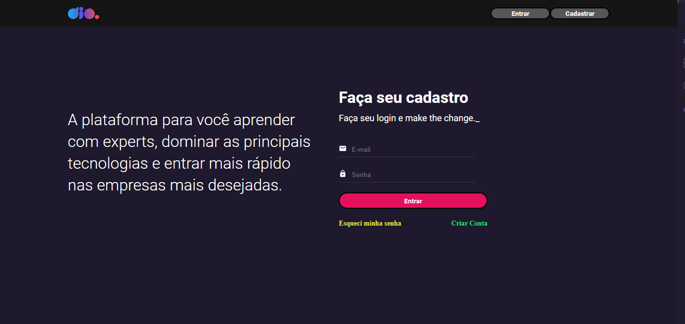

# Tela Inicial da DIO

-Página Inicial

- Página Login

Ajeitei os botões do Header e os paths dos links abaixo dos formulários de Login e Cadastrar. 

Pra rodar basta clonar o repostório, abrir no editor de código de sua preferência e instalar as dependencias do projeto com 'npm install' Após as dependências instaladas, rode com 'npm start'. Para iniciar a api basta colocar no terminal 'npm run api'.

# Tecnologias

- React.js

Feito com ♥ by [Cesar](https://github.com/cesinhalius)